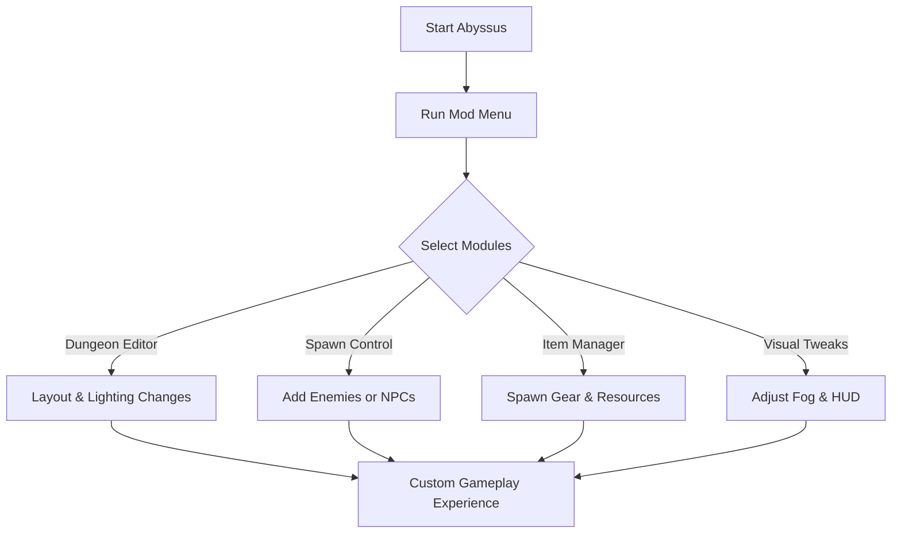

# Abyssus Mod Menu 🌑 for Dungeon Editing & Creative Gameplay

The haunting world of *Abyssus* thrives on atmosphere and danger—but sometimes, you want more control. The **Abyssus Mod Menu** offers advanced customization features, letting you edit dungeons, adjust enemy spawns, and apply immersive visual tweaks. Perfect for creative sandboxing, challenge runs, or testing game mechanics.

[](#)
[](#)
[](#)
[](#)

---

## 🧭 Overview

Where trainers focus on survival stats, the Mod Menu expands into **structural and visual customization**. Players can alter dungeon conditions, spawn allies or foes, and fine-tune environmental effects for a completely unique experience.

---

## ⭐ Features

* **Dungeon Editor** – Modify layouts, lighting, and trap placements live.
* **Spawn Control** – Add or remove enemies, bosses, or NPC allies instantly.
* **Item Manager** – Generate gear, potions, and rare resources at will.
* **Visual Tweaks** – Adjust fog, HUD, or atmospheric lighting.
* **Quick Overlay Menu** – Simple, hotkey-driven UI for toggling features.

[!WARNING]
The Mod Menu is designed for **single-player or private play**. Public use may disrupt balance for others.

---

## 🖥 Compatibility

| Platform      | Status          | Notes                          |
| ------------- | --------------- | ------------------------------ |
| Windows 10/11 | ✅ Supported     | Stable menu build              |
| Steam Deck    | ⚠️ Partial      | May require Proton adjustments |
| Linux         | ⚠️ Experimental | Some UI scaling issues         |
| Consoles      | ❌ Not Supported | PC-only release                |

---

## ⚡ Setup Guide

1. Download the **Abyssus Mod Menu** package.
2. Extract into a secure folder.
3. Run with administrator permissions:

   ```bash
   AbyssusModMenu.exe --start
   ```
4. Launch *Abyssus* and press **F10** to open the in-game menu overlay.
5. Toggle modules:

   * Dungeon Editor
   * Spawn Control
   * Item Manager
   * Visual Tweaks

---

## 🌀 Mod Menu Workflow Diagram



---

## ❓ FAQ

**Q: Can I save dungeon edits?**
A: Yes, custom layouts can be exported and reloaded.

**Q: Will this affect my story progression?**
A: No, edits only affect current sessions.

**Q: Can I use it in co-op?**
A: Yes, but it works best in private lobbies.

**Q: Can I spawn boss fights on demand?**
A: Absolutely—boss triggers are fully supported.

**Q: How often is it updated?**
A: Updates are rolled out alongside Abyssus patches.

---

## 🚀 Final Thoughts

The **Abyssus Mod Menu** gives players complete creative freedom in a dangerous, atmospheric world. From dungeon editing to spawning epic encounters, it transforms Abyssus into a sandbox of endless replayability.


---
